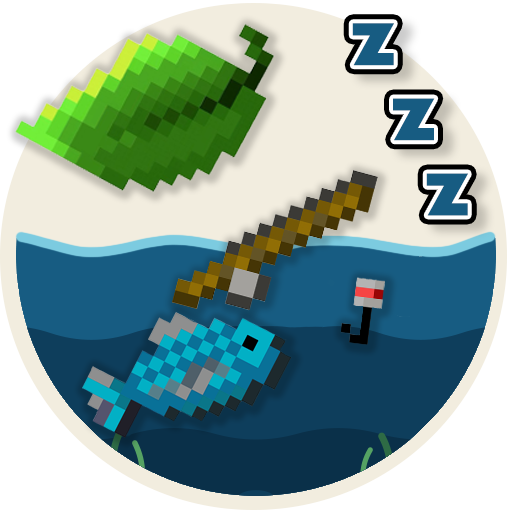
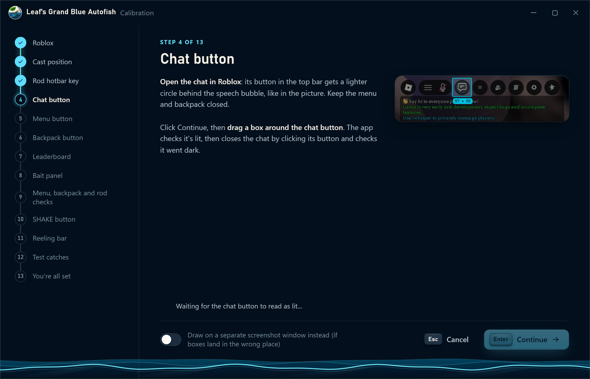
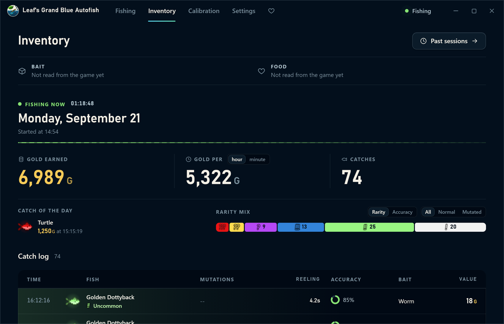

# Leaf's Grand Blue Autofish

**A free fishing assistant for Grand Blue on Roblox.**
It casts, clicks SHAKE, plays the reeling bar and keeps a tally of what you catch.

 

[**Download**](../../releases/latest) &nbsp;·&nbsp; [Getting started](docs/GETTING_STARTED.md) &nbsp;·&nbsp; [Hotkeys](docs/HOTKEYS.md) &nbsp;·&nbsp; [FAQ](docs/FAQ.md) &nbsp;·&nbsp; [Help](docs/TROUBLESHOOTING.md) &nbsp;·&nbsp; [Discord](https://discord.gg/AC8qRsUHsc)

 

> **Risk notice.** Automation can go against Roblox's Terms of Use. Using Leaf's Grand Blue Autofish may get your account warned or banned. It is at your own risk, and the app is unofficial: it is not affiliated with Roblox Corporation or the developers of any game.

## What it does

- **Fishes for you.** Casts, waits for a bite, clicks the SHAKE button, plays the reeling minigame and casts again.
- **Reads every catch.** Fish name, mutations, rarity and what it is worth, from the on-screen catch message.
- **Keeps your sessions.** A live dashboard while you fish, and an Inventory of past sessions with charts, a searchable log and CSV export.
- **Lets some fish go.** Pick rarities to skip and the app lets them off the hook.
- **Calibrates with you.** A guided walk-through teaches it where things are on your screen. You can keep up to five profiles.
- **Stays out of the way.** It pauses by itself when Roblox is not in front, and the main actions have hotkeys.

<table>
<tr>
<td width="50%"></td>
<td width="50%"></td>
</tr>
<tr>
<td align="center">Guided calibration, with a picture for every step</td>
<td align="center">Inventory: charts, log and CSV export</td>
</tr>
</table>

## How it works, and what it never does

It looks at your screen the way you do, then moves the mouse and presses keys. It never reads or changes the game's files or memory. There are no accounts and no tracking, and it makes no network connections of its own. The one exception is optional: if your PC lacks Microsoft's Visual C++ runtime, the first start can download it from Microsoft, but only if you click to let it. Everything it saves stays in its own folder. See the [privacy notice](legal/PRIVACY.txt).

## Install

1. Download `Leafs-Grand-Blue-Autofish-v0.1.0.zip` from the [latest release](../../releases/latest).
2. Unzip the **whole folder** somewhere you can write to, such as Documents. Not inside the zip, and not in "Program Files".
3. Double-click **Leaf's Grand Blue Autofish.exe**, read and accept the licence, and follow the calibration.
4. In Roblox, press **F8** to start and stop fishing.

The zip's SHA256 is `0e3c31ac212c18b30f72d552d2db7c4558daf35a91d8b7aba1f6d984b88736d1`. [How to check it](docs/VERIFY.md).

> **"Windows protected your PC" or an antivirus warning?** The app is not code-signed, because certificates cost money and this is a free project. Any program that clicks the mouse and listens for hotkeys can look suspicious to antivirus software. [Here is how to verify your download](docs/VERIFY.md) before you run it.

## Needs

- Windows 10 or 11, 64-bit
- Roblox open in a window you can see (not minimised)
- Microsoft Edge WebView2, which comes with Windows 10 and 11
- The Microsoft Visual C++ runtime, which most PCs have. If yours does not, the first start explains it and can fetch it for you.

You do not need to install Python or anything else: everything the app needs is in the zip. Tested on Windows 10 (version 22H2).

## Help

- [Getting started](docs/GETTING_STARTED.md): from download to your first session
- [Hotkeys](docs/HOTKEYS.md)
- [FAQ](docs/FAQ.md): safety, bans, antivirus warnings, your data
- [Troubleshooting](docs/TROUBLESHOOTING.md): when a calibration step will not pass
- **[Discord](https://discord.gg/AC8qRsUHsc)**: the quickest place to ask a question or report a problem
- [Report a problem on GitHub](../../issues/new/choose): issues are read, but less often than Discord

## Support the project

It is free and made by one person in their spare time. If it saved you some fishing, a tip is welcome and never expected: [Ko-fi](https://ko-fi.com/leafranger) · [leafranger.dev](https://leafranger.dev/donate).

**About future updates:** supporters are meant to be able to get new builds early. Every update is released to everyone eventually, so nothing is kept behind a paywall for good. Early builds are for the supporters who receive them and are not to be shared before their public release.

## Licence and credits

Free to use. The source code is not published. Use is covered by the [licence](LICENSE.txt); third-party parts are listed in the [notices](legal/THIRD_PARTY_NOTICES.txt).

Made by **Leafranger** · built and inspired from **1vtt**'s fishing macro · special thanks to Werelukey, Magdod0 and neco arc.

© 2026 Mirko "Leafranger" Cisternino. All rights reserved. Not affiliated with Roblox Corporation.
